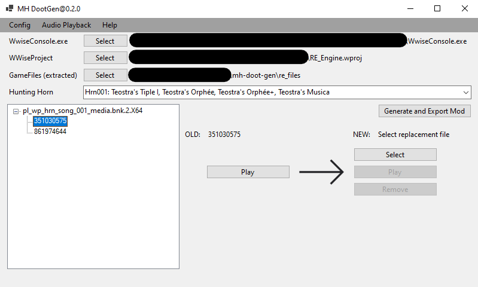

# mh-doot-gen
A small app to generate mods which replace the hunting horn sounds in monster hunter.

## Requirements
- WwiseConsole.exe 
- WWiseProject (.wproj)
- extracted game (can be done with [.bat script](./extract-rise-pak.bat))
- [bnkextr](https://github.com/eXpl0it3r/bnkextr/releases/tag/2.0) (optional only required for original soundplayback)
- [vgmstream](https://github.com/vgmstream/vgmstream/releases/tag/r1879) (optional only required for original soundplayback)

## Features & Support

Features:
- extract & playback horn sound effect
- create mods for horn sound effect replacement

Supported MH Titels:
- Monster Hunter Rise
- Monster Hunter Rise Sunbreak

## How to use

1. Download the latest relase for github
1. Open the mh-doot-gen.exe
1. Select the needed tools (.exe) and the project (.wproj)
1. Select the extracted gamefiles (can be extracted with the extract-rise-pak.bat)
1. Select a horn and replace the sound files to your liking:

1. Generate and export Mod

## Contributors

- Darkblizzard [UI, Main functionalty]

## Acknowledgements
- [WWiseTypes](./doot-gen/WWiseTypes/) and bnk override are addapted from [RingingBloom](https://github.com/Silvris/RingingBloom)  
- [MHR Tool Collection](https://github.com/mhvuze/MonsterHunterRiseModding/wiki/Tool-Collection) (adapted [extraction script](./extract-rise-pak.bat))
- For wem to wav convertion [vgmstream](https://github.com/vgmstream/vgmstream) is used
- For bnk extraction [bnkextr](https://github.com/eXpl0it3r/bnkextr) is used